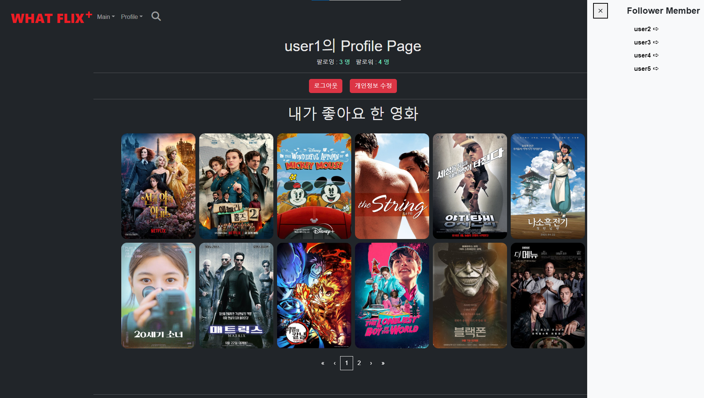

# 8기 FINAL 관통 PJT

# 이상찬

### 1. 팀원 정보 및 업무 분담 내역 🖋

- 🧑이상찬(팀장)
  - TMDB 데이터 추출 및 가공 및 DB 저장
  - 영화 알고리즘 구현(총 4가지-팔로우기반, 유저 기록 기반, 모든 유저의 최근 기록 기반,현재 상영작)
  - 장르별 영화 출력
  - 검색창 및 기능 구현
  - 리뷰, 댓글 생성/수정/삭제/조회 구현(CRUD)
  - 감독, 배우별 정보 이동 링크 생성
  - 별점 평균 계산 작업
  - 영화 세부 정보, 전체 리스트 CSS 작업

  

### 2. 목표 서비스 구현 및 실제 구현 정도 🔎

- 목표 설정

| 목표 서비스 구현                                      | 실제 구현 정도            |
| ----------------------------------------------------- | ------------------------- |
| 회원가입/탈퇴                                         | 완료                      |
| 로그인/로그아웃                                       | 완료                      |
| 비밀번호 변경                                         | 완료                      |
| 영화 정보                                             | 완료                      |
| 영화 리뷰                                             | 완료                      |
| 리뷰 댓글                                             | 완료                      |
| 영화 좋아요                                           | 완료                      |
| 리뷰 좋아요                                           | 완료                      |
| 유저 팔로우                                           | 완료                      |
| 댓글 온오프 기능                                      | 완료                      |
| (알고리즘 추천) 유튜브api활용 유튜버 추천             | 서비스 쪽이므로 삭제 진행 |
| (알고리즘 추천) 장르별, 배우별, 감독별 추천           | 완료                      |
| (알고리즘 추천) 팔로우 기반 추천                      | 완료                      |
| (알고리즘 추천) 사용자 분석 추천                      | 완료                      |
| ↓↓↓↓↓↓↓↓↓↓↓↓추가 기능 구현↓↓↓↓↓↓↓↓↓↓↓↓                |                           |
| + 인피니트 스크롤                                     | 완료                      |
| + 페이지네이션                                        | 완료                      |
| + 검색창                                              | 완료                      |
| + Netflix와 유사한 hover 기능                         | 완료                      |
| + 이미지 클릭 시 고화질 이미지 보기 창으로 연결       | 완료                      |
| + 팔로우 아이디 클릭 시 해당 유저 프로필로 가기       | 완료                      |
| + 회원탈퇴 시 동일한 문구 입력해야 탈퇴되는 기능 구현 | 완료                      |


### 3. 데이터베이스 모델링 (ERD) 


### 4. 영화 추천 알고리즘에 대한 기술적 설명 

1. **당신을 위한 영화**
   - 영화 상세 보기를 누르거나 좋아요 버튼을 누르면 해당 행동이 기록된다.
     - History 테이블에 유저 정보, 영화 정보, 장르 정보, 클릭 시간이 저장
   - 로그인한 유저의 최근 100회의 행동을 불러와서 어떤 장르를 많이 보았는지 계산을 진행한다.
     - 딕셔너리 형태로 각각의 장르에 대해 카운팅 진행
   - 가장 많이 조회한 최상위 장르 2개를 선정한다.
   - 그 후 해당 장르에 한정하여 총 3가지의 추천 기능이 실행된다
     - 랜덤적으로 각각은 3/1의 확률이다.
     - 1) 해당 장르의 평점 순으로 10개 뽑아서 보여주기
       2) 해당 장르의 모든 영화 중 랜덤으로 10개 뽑아서 보여주기
       3) 해당 장르의 최신 영화(1년 내) 중 10개를 랜덤으로 뽑아서 보여주기


```python
@api_view(['GET'])
def movie_recommend(request):
    user = request.user
    actions = History.objects.all().filter(user_id=user.id)

    length = actions.count()
    if length > 100:
        actions = actions[length-100:]

    genre = {}
    dict1 = actions.values()
    for movie in dict1:
        gen = movie['genres']
        if gen in genre:
            genre[gen] += 1
        else:
            genre[gen] = 1
    li = []
    for i in genre.items():
        li.append(i)
    li.sort(key=lambda x : x[1], reverse=True)
    
    if len(li) == 1:
        num = list(range(1, 4))
        getNum = random.sample(num, 1)[0]
        if getNum == 1:     # 평점순 랜덤
            queryset = Movie.objects.filter(genres=li[0][0]).order_by('-vote_average').distinct()[:10]
        elif getNum == 2:   # 올 랜덤
            queryset = Movie.objects.filter(genres=li[0][0]).order_by('?')[:10]
        else:               # 최신영화 중에서 랜덤
            queryset = Movie.objects.filter(genres=li[0][0]).filter(release_date__range=[date.today() - timedelta(days=50), date.today()]).order_by('?')[:10]

    else:
        num = list(range(1, 4))
        getNum = random.sample(num, 1)[0]
        if getNum == 1:     # 평점순 랜덤
            queryset = Movie.objects.filter(genres__in=[li[0][0], li[1][0]]).order_by('-vote_average').distinct()[:10]
        elif getNum == 2:   # 올 랜덤
            movies = Movie.objects.filter(genres__in=[li[0][0], li[1][0]]).values('movie_id').order_by('-vote_average').distinct()
            queryset = Movie.objects.filter(movie_id__in=movies).order_by('?')[:10]
        else:               # 최신영화 중에서 랜덤
            movies = Movie.objects.filter(release_date__range=[date.today() - timedelta(days=365), date.today()]).filter(genres__in=[li[0][0], li[1][0]]).values('movie_id').order_by('-vote_average').distinct()
            queryset = Movie.objects.filter(movie_id__in=movies).order_by('?')[:10]
    serializer = MovieSerializer(queryset, many=True)
    return Response(serializer.data, status=status.HTTP_201_CREATED)
```

2. **팔로우의** **추천**
   - 내가 팔로우한 사람들을 조회한다.
   - 해당 파로우들이 좋아요를 누른 영화들을 수집한다
   - 그 영화들 중에서 내가 좋아요를 누른 영화는 제외하는 필터링을 진행한다.
   - 그렇게 최종 걸러진 영화들을 랜덤으로 10개 택하여 보여준다.


```python
@api_view(['GET'])
def movie_follow_like(request, user_id):
    User = get_user_model()
    user = User.objects.get(id=user_id) # 나의 정보
    my_like_movies = user.like_movies.all()
    following_people = user.followings.all()
    li = []

    # 내가 팔로우 한 사람들이 좋아하는 영화들의 집합
    for following in following_people:
        movies = following.like_movies.all()
        # print(movies)
        for movie in movies:
            if movie not in li:
                li.append(movie)
    # print(li)
    result = []
    for i in li:
        if i not in my_like_movies:
            result.append(i)
    if len(result) > 10:
        new_result = random.sample(result, 10)
    else:
        new_result = random.sample(result, len(result))

    serializer = MovieSerializer(new_result, many=True)
    # print(serializer.data)
    return Response(serializer.data)
```

3. 왓플릭스 HOT 무비
   - 전체 유저에 대한 최근 7일치의 기록을 모두 조회한다.
   - 가장 많은 조회/좋아요를 받은 영화들을 순서대로 10개 추출하여 보여준다.
     - 최근 가장 관심을 받고 있는 영화를 유동적으로 보여줄 수 있다.


```python
@api_view(['GET'])
def movie_trend(request):
    movie_dict = {}
    trends = History.objects.filter(updated_at__gte = timezone.now() - timedelta(days=7))
    for trend in trends:
        movie = trend.movie_id
        if movie in movie_dict:
            movie_dict[movie] += 1
        else:
            movie_dict[movie] = 1

    li = []
    for j in movie_dict.items():
        li.append(j)
    li.sort(key=lambda x: x[1], reverse=True)
    total_li = []
    cnt = 0
    for k in li:
        trend_movie = Movie.objects.get(movie_id=k[0])
        total_li.append(trend_movie)
        cnt += 1
        if cnt == 10:
            break
    serializer = MovieListSerializer(total_li, many=True)
    return Response(serializer.data)
```

4. 현재 상영작
   - TMDB API로 받아온 영화 정보를 시간순으로 정렬한다.
   - 최근 한 달 내에 개봉한 영화들을 나열하여 보여준다.


5. 관련 영화 추천
   - 영화 상세 보기에 들어갔을 때 TMDB에서 제공하는 관련 추천 영화 정보가 있으면 해당 정보를 보여준다
   - 만약 TMDB에 관련 영화 추천 정보가 없을 경우 영화 장르와 동일한 영화를 랜덤으로 6개 보여준다.


```python
@api_view(['GET'])
def movie_related(request, movie_id):
    movie = Movie.objects.get(movie_id=movie_id)
    li = movie.genres.all()
    movies = Movie.objects.all().filter(recommend_movie_id=movie_id)[:6]
    if not(movies):
        if len(li) == 1:
            movies = Movie.objects.all().filter(genres__in=[li[0]]).exclude(movie_id__in=[movie_id]).order_by('?')[:6]
        else:
            movies = Movie.objects.all().filter(genres__in=[li[0], li[1]]).exclude(movie_id__in=[movie_id]).order_by('?')[:6]
    serializer = MovieSerializer(movies, many=True)
    return Response(serializer.data)
```


###  5. 서비스 대표 기능에 대한 설명 

- 메인 페이지
  - 알고리즘 추천 영화와 전체 영화가 나열되어있다.
    - 인피니트 스크롤링이 적용되어 있어 스크롤이 다 내려가면 다시 영화 정보를 불러 온다.
  - navbar에 기본적으로 로그인, 로그아웃, 프로필, 회원 정보 수정, 장르별, 무비별 탭을 갖추고 있다.


- 검색 기능
  - 단어를 입력할 때마다 즉각적으로 관련 영화가 찾아진다
  - 배우/감독/영화 제목/줄거리에 대한 정보를 모두 필터해서 찾아주므로, 광범위한 검색 엔진을 가진다.


- 프로필
  - 해당 프로필 페이지를 가진 유저의 좋아요한 영화와 리뷰를 볼 수 있다.
  - 로그아웃, 개인정보 수정 기능도 같이 추가되어 있다.


- 정보 변경
  - 비밀 번호 변경과 회원탈퇴 기능 가진다.


- 장르별 영화 조회
  - 장르별로 영화를 조회할 수 있는 기능을 갖추고 있다.


### 6. 기타 (느낀 점, 후기 등)

- 이상찬 후기

백엔드와 프론트 엔드를 모두 작업하였는데 각자의 매력을 가지고 있었던 것 같습니다. 특히 백엔드 영역에서 데이터를 조작, 가공, 수집하는 부분이 너무 재미있었고 관련 데이터로 알고리즘을 짜는 것도 정말 흥미로웠습니다. 우리가 원하는 알고리즘을 구현하기 위해 serializer와 django ORM에 대한 학습과 이해가 필요했고, 그 이전에는 데이터 원본에 대한 가공과 수집이 중요하다는 점도 확인할 수 있었습니다. 데이터베이스의 효율을 추구해서 필요한 정보만을 가져왔지만 작업을 진행하면서 추가 데이터가 필요하다는 것을 늦게 깨닫게 되었고 model을 재설정하는 경우도 존재했습니다. 그런 과정이 까다롭고 어려웠지만 하나의 경험으로 작용해 추후에는 조금더 원만하게 테이블 스키마를 설정하고 정보를 추출해야 겠다는 교훈을 깨닫게 되었습니다. 준수님과 협업을 하면서 불가능해보였던 기능들을 구현하고, 예상치 못한 버그를 고치는 등의 작업 또한 너무 재미있었습니다. 준수님 집에 3박을 머물면서 했던 프로젝트는 저에게 잊지 못할 추억이 될 것 같습니다. 2학기 프로젝트에서도 백엔드와 프론트 엔드를 균형있게 잡아서 진행해볼 자신감이 생겼습니다.


# 박준수

## 0. 기획 구상 및 업무 일정 설정

1. 가장 처음 생각 할 것들 

   - 영화 추천 사이트인지 영화 판매 사이트인지? 
     - 목적 : 커뮤니티 기능을 갖춘 영화 추천 웹 서비스

2.  방향성 설정

   - UI/UX에 집중하여 기존의 서비스들이 가지고 있었던 레이아웃, 시스템, 서비스 자체를 수정
   - 기존 서비스에 존재하지 않는 추가 기능에 집중
   - 방대한 데이터베이스를 구축하여 양적 승부

3. 알고리즘 아이디어

   - 한 장르의 세분화를 통해 딥하게 들어가기(ex>애니메이션 장르를 더 세분화 진행)
   - 유명가수, 인플루언서들의 추천 영화 소개하기(영화 유튜버 등등)
   - 영화 월드컵을 진행해 오락성 요소도 추가해보기
   - 장르별, 가수별, 감독별로 나누어 추천
   - 리뷰에 대해 공감을 많이 받은 사람은 등급이 높아지고, 등급높은 사람들의 영화 추천
   - 시간대별 추천, 날씨별 추천
   - 예고편 & 쇼츠
   - 듣는 영화
   - 댓글 스포 방지 기간

4. 업무 목록

   1. 회원가입/탈퇴

   2. 로그인/로그아웃

   3. 비밀번호 변경

   4. 영화 정보

   5. 영화 리뷰

   6. 리뷰 댓글

   7. 영화 좋아요

   8. 리뷰 좋아요 

   9. 유저 팔로우

   10. 댓글 온오프 기능

   11. 추천(알고리즘)

       - 유튜브api활용 유튜버 추천

       - 장르별, 배우별, 감독별 추천

       - 팔로우 추천

       - 사용자 분석 추천

1일차: 1, 2, 3  / 2일차: 4, 5, 6 / 3일차: 7, 8, 9, 10 / 4 ~ 5일차 : css / 6일차 ~: 알고리즘 집중 코딩

##  1. 팀원 정보 및 업무 분담 내역 🖋

🧑박준수 - vuex 및 vue router을 이용한 accounts 제작(프론트, 백엔드 경험)

- 기능(백엔드)
  - 회원가입 / 탈퇴
  - 로그인 / 로그아웃
  - 비밀번호 변경
  - 유저 팔로우

- 인터넷 페이지(프론트)
  - 회원가입
  - 로그인
  - 프로필 페이지
    - 공통
      - 팔로잉, 팔로워 수 표현
    - 내 프로필일 때
      - 로그아웃(Modal)
      - 정보변경
        - 비밀번호 변경
        - 회원탈퇴(Modal)
        - 돌아가기
    - 상대방 프로필일 때
      - 팔로우
- 잡다한 기능들
  - 백엔드
    - 유저 아이디 입력 시 유저 pk반환 url 및 view
    - 유저 pk 입력 시 유저 아이디 반환 url 및 view
  - 프론트
    - 인피니티 스크롤
    - 페이지네이션
    - 외부 주소 새창에서 열기


## 2. 목표 서비스 구현 및 실제 구현 정도 🔎

위와 동일


## 3. 서비스 대표 기능에 대한 설명 

1. 회원가입

   dj_rest_auth를 사용한 DJango의 유저 관리 기능
   중복된 유저 아이디, 비밀번호 제한사항들을 자동으로 관리해준다.

   

2. 로그인

   dj_rest_auth를 사용한 DJango의 유저 관리 기능

3. 네비게이션 바
   

   프로필페이지로 진입 가능
   로그아웃 모달로 바로 이동 가능
   정보 변경 페이지로 이동 가능

4. 프로필 페이지

   

   본인 페이지

   팔로잉/팔로워 버튼을 통해 나의 팔로잉/팔로워 유저를 볼 수 있고,
   유저 아이디를 클릭하면 해당 유저의 프로필로 이동 가능
   로그아웃 버튼으로 로그아웃 모달로 이동 가능
   개인정보 수정 버튼으로 정보 변경 페이지로 이동 가능
   내가 좋아요 한 영화리스트가 나오며 페이지네이션으로 표시
   내가 쓴 리뷰가 나오며 페이지네이션으로 표시

   
   다른 사용자의 페이지

   나의 해당 사용자 팔로우 여부를 확인하여
   팔로우가 되어있지 않으면 '팔로우',
   팔로우가 되어있으면 '팔로우 취소' 버튼이 활성화

   이외 기능은 동일

   

5. 로그아웃

   

   모달로 만들어 네비게이션 바와 나의 프로필 페이지에서 접근이 가능하도록 제작
   
6. 정보 변경
   

   돌아가기 버튼으로 이전 페이지로 이동 가능
   비빌번호 변경 가능
   회원탈퇴(모달)로 이동 가능

   

7. 회원탈퇴
   

   입력 칸에 '회원탈퇴'를 작성해야 회원탈퇴 버튼이 활성화 되도록 제작

   

## 4. 기능의 알고리즘

- 인피니티 스크롤과 페이지네이션

  - 전체 영화를 받아와서 이미 데이터로 가지고 있던 상황이었음

  - 표현하고 싶은 영화 목록도 이미 갖추어져 있어서 v-if문을 사용하여 조건을 걸어 표현하기로 함

  - 조건은 가진 영화의 인덱스 번호와 새롭게 만든 제한 숫자(페이지니에션이면 페이지 번호 등)의 관계 사용

    - 인피니티 스크롤: 제한 숫자의 한도를 이벤트 발생시마다 증가
    - 페이지네이션: 한번에 표시할 개수를 페이지 숫자를 통해 제한하는 형식

    

## 5. 후기 및 느낀 점

처음엔 유저의 정보를 vuex의 store에 넣어두고 작업을 했었음.

그렇게 하니 사용자가 크롬의 vue를 사용해 자신의 정보를 임의로 변경하여 axios를 요청할 수 있었고
이로 인해 다른 사용자의 정보에 접근할 수 있게 되는 문제가 생김.

그래서 store에 저장된 사용자의 정보는 오직 본인의 토큰 하나만 저장하여
사용자가 임의로 변수를 변경할 수 있는 가능성을 최대한 줄이면서 홈페이지를 제작함.
결과적으로 유저 정보 관련된 통신 시 데이터가 저장되지 않고 휘발되어 매번 통신을 다시 해줄 필요가 생겼음.
사용자가 접근하기 어려운 방법을 사용하게 되어 안전하게 데이터를 저장할 수 있다면 통신횟수를 줄일 수 있을 것임.

axios 요청과 DJango의 response에 익숙치 않아 어떠한 형태로 통신을 하는지 몰라서 초반에 어려움을 겪었었음.
정해진 틀은 있겠지만 필요한 내용은 내가 직접 담을 수 있다는 것을 깨닫고는 사용이 수월해짐.

간단한 기능 구현에 최선을 다 하는 것으로 팀장님과 합의하여 유저 정보 관련 부분을 맡았음.
그러나 유저 정보는 다른 정보와 다르게 보안 부분도 고려해야 되서 예상했던 것 보다 많이 수정을 하였음.

영화 데이터의 추출을 위한 알고리즘은 팀장님과 아이디어 공유를 가장 활발하게 한 부분이었음.
어떻게 뽑아야 하는지 등의 아이디어를 많이 나누었고,
팀장님의 구현능력이 빛을 발해 아이디어대로 구현이 된 것이 놀라웠음.

나의 아이디어
유저들의 행적을 가져올 때 단순 조회와 좋아요를 구분하는 방법으로 가중치를 사용하여 좋아요를 한 영화의 점수가 더 높게 설정되도록 하기